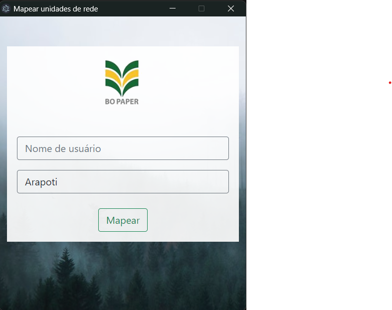

# Aplicativo de Mapeamento de Caminhos de Rede

## Introdução
Este repositório contém o código-fonte e a documentação para o aplicativo de mapeamento de caminhos de rede desenvolvido com Electron.

## Visão Geral
O aplicativo é projetado para simplificar o processo de mapeamento dos caminhos de rede do Windows para servidores de arquivos em duas fábricas distintas.

## Funcionalidades Principais
1. **Login do Usuário:**
   - O usuário deve fornecer as credenciais de rede para autenticação.
   
2. **Seleção da Fábrica:**
   - Permite ao usuário escolher entre as fábricas de Arapoti e Jaguariaíva.

3. **Mapeamento de Caminhos:**
   - Após a autenticação, o usuário pode inserir o nome do usuário de rede para mapear os caminhos correspondentes.

4. **Visualização de Caminhos Mapeados:**
   - Apresentação clara dos caminhos de rede mapeados.

## Guia do Usuário
### Instalação
1. Faça o download do aplicativo no GitHub.
2. Execute o aplicativo com um click.

### Uso Básico
1. Abra o aplicativo.
2. Insira suas credenciais de rede.
3. Escolha a fábrica desejada.
4. Insira o nome do usuário de rede.
5. Clique em "Mapear".
6. Visualize os caminhos de rede mapeados na interface.

## Solução de Problemas
- **Erro de Autenticação:**
   - Verifique as credenciais de rede fornecidas.
   
- **Caminhos Não Mapeados:**
   - Certifique-se de que o usuário de rede existe e tem permissões adequadas.
